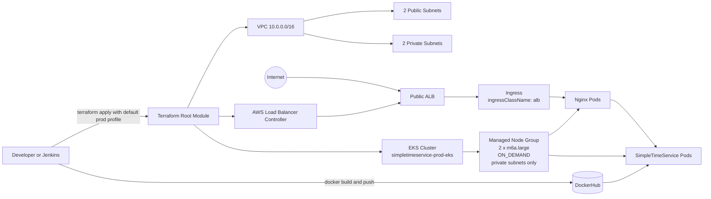

# SimpleTimeService - DevOps Challenge Submission

This repository contains a minimal web service and infrastructure code for the Particle41 DevOps assessment.

## Repository Structure

```text
.
├── app/        # FastAPI service, Dockerfile, and local docker compose files
├── k8s/        # Kubernetes manifest (Deployment + Service)
└── terraform/  # Terraform code for VPC + EKS
```

## System Diagram



## Prerequisites

Install the following tools:

- Python 3.12+ (https://www.python.org/downloads/)
- Docker and Docker Compose (https://docs.docker.com/get-docker/)
- kubectl (https://kubernetes.io/docs/tasks/tools/)
- Terraform >= 1.6 (https://developer.hashicorp.com/terraform/install)
- AWS CLI v2 (https://docs.aws.amazon.com/cli/latest/userguide/getting-started-install.html) for helper scripts, EKS authentication, and the Terraform Helm-based AWS Load Balancer Controller install used in this repository

## AWS Authentication

Do not commit credentials. Configure AWS credentials locally before running Terraform.

Example:

```sh
aws configure
```

Or use environment variables:

```sh
export AWS_ACCESS_KEY_ID="..."
export AWS_SECRET_ACCESS_KEY="..."
export AWS_DEFAULT_REGION="us-east-1"
```

Region note: examples in this README use `us-east-1` because that is the tested default.
You can deploy to a different AWS region by overriding:

- Terraform variable `aws_region` (for example via `terraform.tfvars` or `-var="aws_region=<region>"`)
- Jenkins parameter `STS_AWS_REGION`

## Task 1 - Application, Docker, and Kubernetes

### 1. Run service locally (optional)

```sh
cd app
pip install -r requirements.txt
uvicorn main:app --reload --no-access-log
```

Test endpoint:

```sh
curl http://localhost:8000/
```

Expected JSON shape:

```json
{
  "timestamp": "2026-04-07T17:51:42.923090+00:00",
  "ip": "203.0.113.10"
}
```

### 2. Build and publish container image to DockerHub

From repository root:

```sh
docker login
docker build -t nsniteshsonal37/simpletimeservice:1.0.2 ./app
docker push nsniteshsonal37/simpletimeservice:1.0.2
```

Optional Jenkins pipeline:

- A root `Jenkinsfile` is included to build from `app/` and push to DockerHub.
- The pipeline is written for a Linux Jenkins agent with Docker installed.
- The pipeline uses plain Docker CLI commands, so it does not require the Jenkins Docker Pipeline plugin.
- If Jenkins itself runs in a container, that container still needs access to a working Docker daemon.
- Store DockerHub credentials in Jenkins Credentials, not in the repository.
- Configure a Jenkins `Username with password` credential with ID `dockerhub-credentials`.
- The `Jenkinsfile` reads that credential via `withCredentials(...)` and passes it to `docker login --password-stdin`.
- Default pipeline tag is `1.0.2`; override it with the `STS_IMAGE_TAG` parameter.
- Set `STS_PUSH_LATEST=true` if you also want to publish the `latest` tag.
- Set `STS_DEPLOY_TO_EKS=true` to enable CD rollout to EKS after a successful image push.
- For CD rollout, set `STS_AWS_REGION` and `STS_EKS_CLUSTER_NAME` parameters.
- The infrastructure and deploy helper scripts also generate `terraform/post-apply.env` with pipeline-friendly values such as `STS_AWS_REGION`, `STS_EKS_CLUSTER_NAME`, `STS_CLUSTER_ENDPOINT`, and `STS_PUBLIC_URL`.
- That file is intended as a local handoff artifact for operators after `terraform apply` or `deploy`; Jenkins should not assume it exists on the agent unless you explicitly copy or publish it there.
- On a separate Jenkins machine, read the needed values from `terraform output` or copy the contents of `terraform/post-apply.env` into Jenkins job parameters or environment configuration.
- The CD stage updates the `simpletimeservice` deployment image with `kubectl set image` and waits for rollout.

### 3. Deploy to Kubernetes

```sh
kubectl apply -f k8s/microservice.yml
```

Verify:

```sh
kubectl get pods
kubectl get svc
```

The application Service `simpletimeservice` is internal (`ClusterIP`).
The Nginx Service is also internal (`ClusterIP`) for zero-trust default posture.
The manifest also includes an Ingress resource (`simpletimeservice-ingress`) that routes `/` to `simpletimeservice-nginx`.
In the EKS path implemented in this repository, Terraform installs the AWS Load Balancer Controller and that Ingress provisions an internet-facing ALB using `ingressClassName: alb`.
If you apply the manifest to some other Kubernetes cluster without a compatible ingress controller, the Deployment and Services still deploy, but the Ingress will not receive a public address automatically.

## Task 2 - Terraform (VPC + EKS)

The Terraform code creates:

- 1 VPC
- 2 public subnets
- 2 private subnets
- 1 EKS cluster
- 1 managed node group with profile-driven defaults (`dev` or `prod`)
- 1 AWS Load Balancer Controller installation for ALB-backed Kubernetes Ingress
- EKS worker nodes on private subnets only

Profile switching:

- Default profile is `deployment_profile = "prod"` so `terraform plan` and `terraform apply` produce the assessment-sized infrastructure by default.
- Switch to lower-cost development defaults with:
  - `deployment_profile = "dev"` in `terraform/terraform.tfvars`, or
  - `terraform apply -var="deployment_profile=dev"`

Profile switch scripts:

- PowerShell:

```powershell
./scripts/switch-profile.ps1
```

- Bash:

```bash
./scripts/switch-profile.sh
```

Both scripts write `terraform/profile.auto.tfvars`, which Terraform loads automatically.

Terraform-only apply scripts (profile selection + Terraform init/validate/apply):

- PowerShell:

```powershell
./scripts/apply.ps1
./scripts/apply.ps1 -Profile dev
./scripts/apply.ps1 -Profile dev -NoAutoApprove
./scripts/apply.ps1 -Profile dev -AllowedCidr 203.0.113.10/32
```

- Bash:

```bash
./scripts/apply.sh
./scripts/apply.sh --profile dev
./scripts/apply.sh --profile dev --no-auto-approve
./scripts/apply.sh --profile dev --allowed-cidr 203.0.113.10/32
```

After a successful Terraform apply, both scripts write `terraform/post-apply.env` containing machine-readable exports for downstream tooling:

```dotenv
STS_AWS_REGION=us-east-1
STS_EKS_CLUSTER_NAME=simpletimeservice-dev-eks
STS_CLUSTER_ENDPOINT=https://...
STS_DEPLOYMENT_PROFILE=dev
STS_ENVIRONMENT=dev
STS_VPC_ID=vpc-...
STS_PUBLIC_SUBNET_IDS=subnet-...,subnet-...
STS_PRIVATE_SUBNET_IDS=subnet-...,subnet-...
STS_DOCKERHUB_IMAGE=nsniteshsonal37/simpletimeservice:1.0.2
STS_PUBLIC_URL=
```

At the `apply` stage, `STS_PUBLIC_URL` is expected to be blank because the Kubernetes workload and ingress have not been deployed yet.

One-click deploy scripts (Terraform + kubeconfig + Kubernetes apply):

- PowerShell:

```powershell
./scripts/deploy.ps1 -Profile prod
./scripts/deploy.ps1 -Profile prod -AllowedCidr 203.0.113.10/32
```

- Bash:

```bash
./scripts/deploy.sh --profile prod
./scripts/deploy.sh --profile prod --allowed-cidr 203.0.113.10/32
```

By default these scripts run `terraform apply -auto-approve`.
Use `-NoAutoApprove` (PowerShell) or `--no-auto-approve` (Bash) to require manual confirmation.
By default these scripts enforce private-only EKS API access.
Use `-AllowedCidr` (PowerShell) or `--allowed-cidr` (Bash) to temporarily enable public EKS API access restricted to a specific IP range.
After a successful deploy, the same `terraform/post-apply.env` file is refreshed and includes `STS_PUBLIC_URL` once the ALB-backed ingress hostname is available.
This file is useful for copying deployment metadata into an external CI/CD system, but it is not committed and should be treated as local runtime output.
When the ingress is ready, you can also inspect the public hostname directly with `kubectl get ingress simpletimeservice-ingress`.

One-click destroy scripts (Kubernetes delete + Terraform destroy):

- PowerShell:

```powershell
./scripts/destroy.ps1
```

- Bash:

```bash
./scripts/destroy.sh
```

By default these scripts run `terraform destroy -auto-approve`.
Use `-NoAutoApprove` (PowerShell) or `--no-auto-approve` (Bash) to require manual confirmation.

Cost-optimized dev profile defaults:

- `az_count = 2` (minimum required by EKS control plane)
- `node_instance_types = ["t3.medium"]`
- `node_capacity_type = "SPOT"`
- `node_desired_size = 1`
- `node_min_size = 1`
- `node_max_size = 1`

Prod profile defaults:

- `az_count = 2` (multi-AZ)
- `node_instance_types = ["m6a.large"]`
- `node_capacity_type = "ON_DEMAND"`
- `node_desired_size = 2`
- `node_min_size = 2`
- `node_max_size = 2`

Optional explicit overrides:

- Any `node_*` variable you set explicitly will override profile defaults.

### 1. Deploy infrastructure

```sh
cd terraform
terraform init
terraform fmt -recursive
terraform validate
terraform plan
terraform apply
```

### 2. Configure kubectl for the cluster

After apply completes:

```sh
aws eks update-kubeconfig --region <aws-region> --name <cluster-name>
```

If you want the exact values produced by the current stack without parsing Terraform state manually, inspect `terraform/post-apply.env` or run:

```sh
terraform output
terraform output -raw aws_region
terraform output -raw cluster_name
```

Because this Terraform configuration installs the AWS Load Balancer Controller through the Helm provider and authenticates to EKS with `aws eks get-token`, the AWS CLI must be installed for a full `terraform apply` of this repository as written.

Then deploy the service:

```sh
kubectl apply -f k8s/microservice.yml
```

## Cleanup

Terraform resources:

```sh
cd terraform
terraform destroy
```

Kubernetes workload only:

```sh
kubectl delete -f k8s/microservice.yml
```

## Notes

- The Docker container runs as a non-root user.
- The app and Nginx Services are `ClusterIP` (internal-only by default).
- EKS API endpoint is private-only by default; public endpoint access is only enabled when a restricted CIDR is provided.
- Extra-credit sidecar implemented: OpenTelemetry Collector runs as a sidecar in the app pod and receives telemetry on `localhost:4317`.
- Health probe traffic is excluded from manual request logging and OpenTelemetry tracing to reduce observability noise.
- No secrets are committed to this repository.

## Extra Credit Coverage

Against the optional extra-credit list, this repository currently covers:

- Implemented: Kubernetes manifest best practices (resource requests/limits, readiness/liveness probes, rolling update strategy, PodDisruptionBudget, pod anti-affinity)
- Implemented: Sidecar container pattern via OpenTelemetry Collector in `k8s/microservice.yml`
- Implemented: CI/CD pipeline via root `Jenkinsfile` (build, DockerHub push, optional EKS rollout)
- Implemented: Terraform Helm provider usage with a public chart (`aws-load-balancer-controller`)